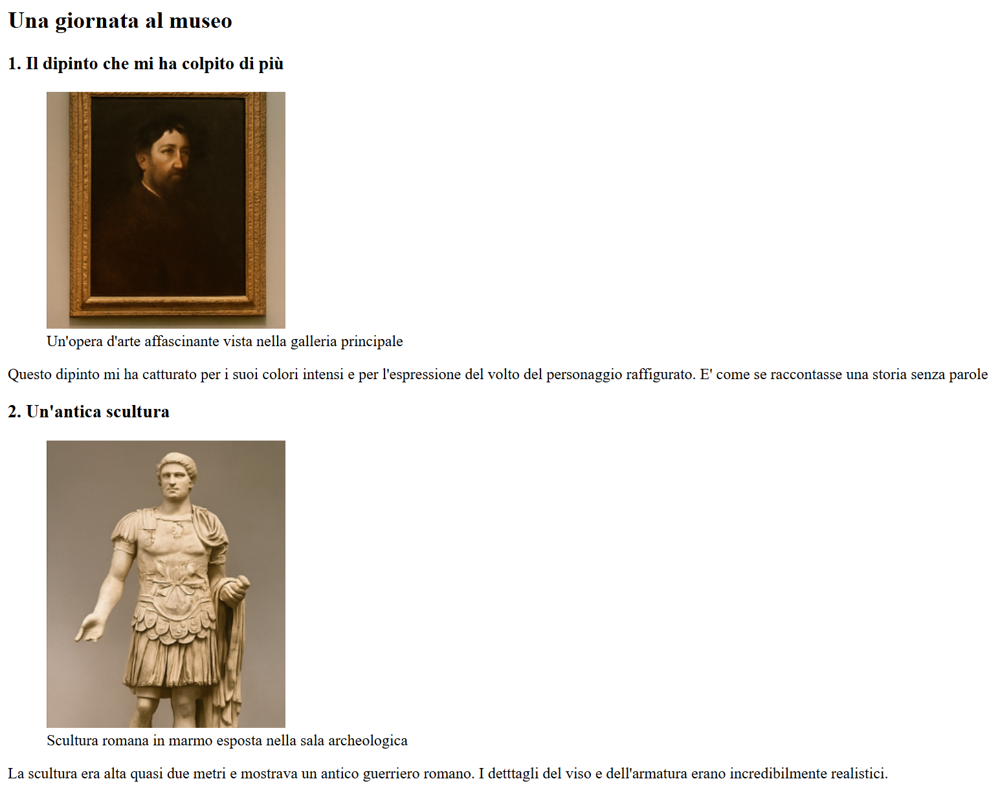
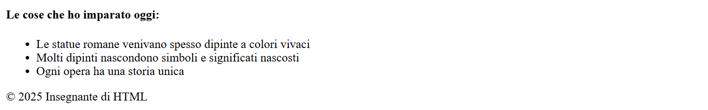

<h1 align="center">Hello Git – Una giornata al museo</h1>

  Esercizio svolto durante il corso Boolean per prendere confidenza con Git e con la struttura base di una pagina HTML.

## Obiettivo

- Creare la cartella del nuovo progetto e aprirla con VS Code.
- Creare un file HTML di base.
- Inizializzare il repository Git ed effettuare il primo commit.
- Effettuare il primo push su GitHub.
- Continuare in modo incrementale fino allo sviluppo completo del layout proposto:
  - intestazione con titolo della pagina;
  - sezione con le opere d'arte (immagini + descrizioni);
  - sezione con elenco puntato delle cose imparate;
  - piè di pagina con copyright.

## Anteprima

## Tecnologie utilizzate

- HTML